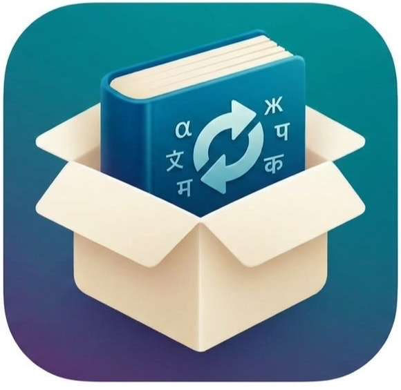

<p align="center">
  
</p>

<h1 align="center">TransliterationKit</h1>

<p align="center">
  <a href="https://github.com/kevinissac/TransliterationKit/releases"></a>
  <a href="https://github.com/kevinissac/TransliterationKit/actions/workflows/test.yml"></a>
  <a href="LICENSE"></a>
  <a href="https://jitpack.io/#kevinissac/TransliterationKit"></a>
  <a href="https://www.npmjs.com/package/transliterationkit"></a>
  
  
</p>

## What is this package?

Phonetic transliteration of Brahmic scripts (Malayalam, Tamil, …) into Latin letters, for
Android (Kotlin/JVM), iOS (Swift) and the web (JavaScript). All three share one set of scheme
data and one set of test cases, so they produce identical output.

## Installation

### Android (Kotlin/JVM) — via [JitPack](https://jitpack.io)

```kotlin
// settings.gradle.kts
dependencyResolutionManagement {
    repositories {
        maven("https://jitpack.io")
    }
}

// build.gradle.kts
dependencies {
    implementation("com.github.kevinissac:TransliterationKit:v1.0.1")
}
```

### iOS / macOS (Swift Package Manager)

In Xcode choose **File → Add Package Dependencies…** and enter
`https://github.com/kevinissac/TransliterationKit`, or in `Package.swift`:

```swift
dependencies: [
    .package(url: "https://github.com/kevinissac/TransliterationKit", from: "1.0.1"),
],
targets: [
    .target(name: "YourApp", dependencies: [.product(name: "TransliterationKit", package: "TransliterationKit")]),
]
```

### Web / Node

```
npm install transliterationkit
```

## Languages supported

- [x] Malayalam (`ml`)
- [x] Tamil (`ta`)
- [ ] Hindi, Telugu, Kannada, Bengali (soon)

## Usage

A language is identified by its code (`"ml"`, `"ta"`). Unsupported codes return the text unchanged.
If you'd rather pass names or an enum in your own code, keep a small mapping to the code; the
library deliberately has one way in.

Kotlin:

```kotlin
import com.kevinissac.transliterationkit.Transliterator

Transliterator.transliterate("ക്രിസ്തു", "ml")
Transliterator.supports("ta")        // true
Transliterator.supportedCodes        // ["ml", "ta"]
```

Swift:

```swift
import TransliterationKit

Transliterator.transliterate("ക്രിസ്തു", code: "ml")
Transliterator.supports(code: "ta")  // true
Transliterator.supportedCodes        // ["ml", "ta"]
```

JavaScript:

```js
import { transliterate, supports, supportedCodes } from "transliterationkit";

transliterate("ക്രിസ്തു", "ml");
supports("ta");                      // true
```

## Options

| Option | Default | Effect |
| --- | --- | --- |
| `capitalize` | off | Uppercase the first letter of each word that follows whitespace or a digit. The very first character of the input is left as is. |
| `html` | off | Treat the input as HTML. With `capitalize`, only text outside tags is changed (tags and attributes are left alone), and the first letter of a text node that follows a tag counts too. |

```kotlin
Transliterator.transliterate(text, "ml", TransliterationOptions(capitalize = true))
```
```swift
Transliterator.transliterate(text, code: "ml", options: .init(capitalize: true, html: true))
```
```js
transliterate(text, "ml", { capitalize: true, html: true });
```

The output is a casual phonetic style (like "Manglish"/"Tanglish"), not ISO 15919 or IAST.
Known limit: Tamil consonants are not voiced by context (`anbu` comes out as `anpu`).

## Adding a language

1. Add `data/schemes/<code>.json` (see `ml.json`): ordered tables of vowels, compounds,
   consonants, vowel signs (modifiers), finals and nasals, plus the virama and the
   inherent/word-final vowels. Order matters — rules are applied in sequence.
2. Add input lines to `data/tests/inputs.tsv` (`code<TAB>text`).
3. Run `python3 tools/generate.py` to regenerate the Swift, Kotlin and JS tables.
4. Run `node tools/generate_tests.mjs` to record the expected
   output in `data/tests/cases.tsv`, then run all three test suites.

The JavaScript engine (`js/src/engine.js`) is the reference implementation. The Swift and
Kotlin engines are ports of it: they use ASCII-only character classes where ICU/Java would
otherwise be Unicode-aware, so results match.

## Development

```
python3 tools/generate.py                       # after editing anything in data/schemes
swift test                                      # Swift
./gradlew :transliterationkit-android:test      # Kotlin
(cd js && npm test)                             # JavaScript
```

CI fails if the generated tables are stale or if any platform's output differs from the shared
cases. Release all three together under one tag.

## Layout

```
data/schemes/               one JSON file per language
data/tests/                 shared inputs and expected output
tools/                      generate.py builds the tables; generate_tests.mjs records expected output
Sources/TransliterationKit  Swift library
android/                    Kotlin library (transliterationkit-android)
js/                         JavaScript package
```

## License

MIT — see [LICENSE](LICENSE).

## Acknowledgements

Inspired by [ml2en](https://github.com/knadh/ml2en) by Kailash Nadh.
